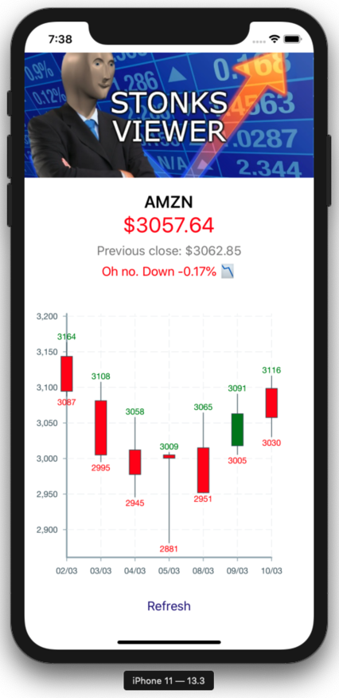
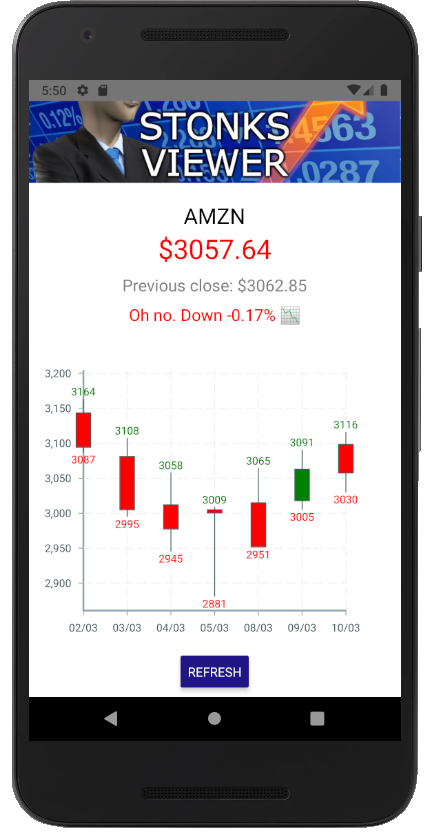

# Stonks Viewer - React Native App (Android/iOS)


## Overview

Basic Stock Viewer starter displaying current price and last 7 days of candlestick data for AMZN. Lot's of room for extending.

## Getting Started

These instructions will get you a copy of the project up and running on your local machine for development and testing purposes.

### Install

1. Duplicate `.env.sample` and rename to `.env`
2. Replace `TOKEN` with your Finnhub key or [get one free](https://finnhub.io/dashboard)

- _IMPORTANT_: This is not a secure place for API keys and intended for local/development use only. For better ways to handle this please see: [React Native Security](https://reactnative.dev/docs/security)

3. `npm install`

- then for iOS: `cd ios && pod install`

4. Ensure you have your target development environment ready or [set it up](https://reactnative.dev/docs/environment-setup)

### Run

```
yarn start
```

Then:

#### For iOS

```
yarn ios
```



#### For Android

```
yarn android
```



## Built With

- [React Native 0.63](https://reactnative.dev/docs/getting-started)
- [Finnhub Stock API](https://finnhub.io/)
- [Victory Native Charts](https://formidable.com/open-source/victory/docs/native)

## Structure

```
src/
├── __mocks__/
│     └── *.mock
├── assets/
├── components/
│     └── Component/
│         ├── __tests__/
│         ├── index
│         └── styles
├── interfaces/
│     └── *.interface
├── services/
│     ├── service/
│     │   ├── getThis
│     │   ├── getThat
│     │   └── index
│     └── index
├── utils/
│     └── *.utils
├── App
└── styles.global
```

## ToDos

- [ ] Extend to some other Stonks (FAANG perhaps?)
- [ ] Add interactivity to chart, resolution/range changing
- [ ] Market open/closed indicator
- [ ] Use Websocket for real-time price streams
- [ ] Much more testing
- [ ] Much more styling (maybe styled-components)
